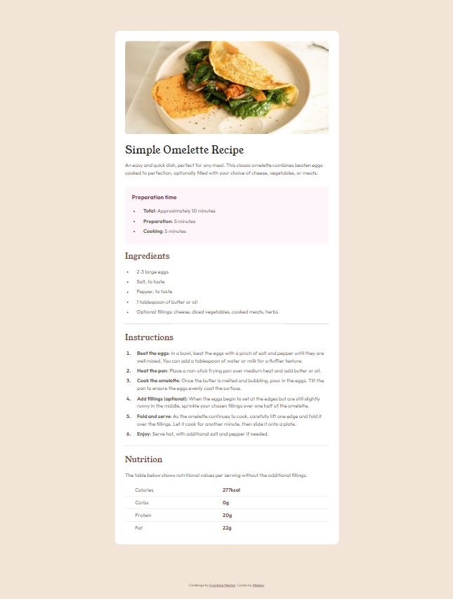
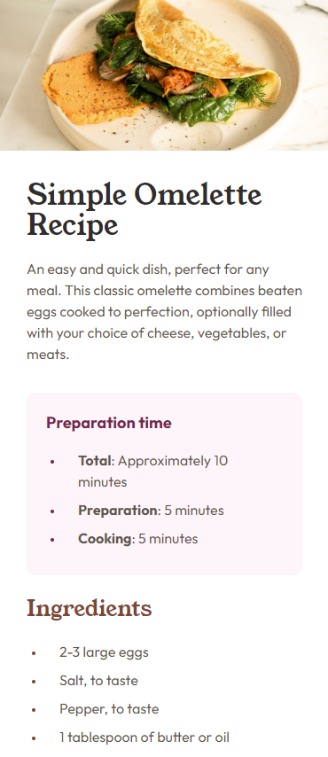
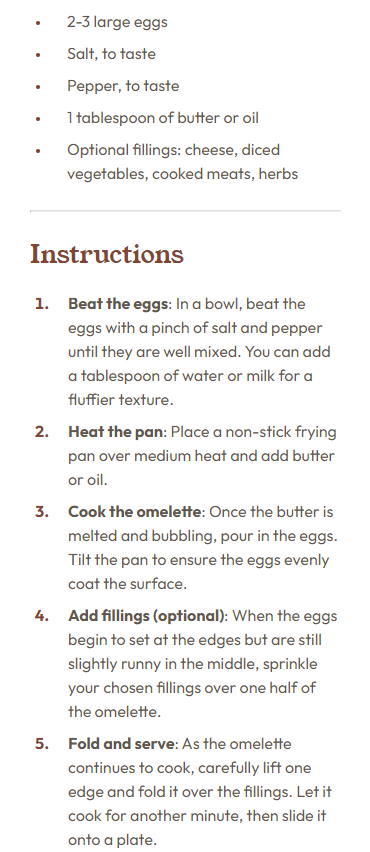
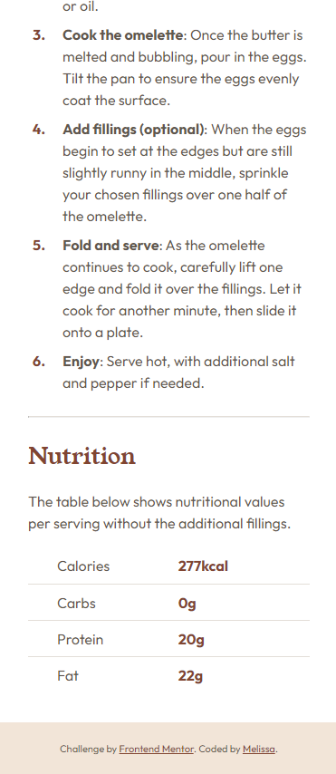

# Frontend Mentor - Recipe page solution

This is a solution to the [Recipe page challenge on Frontend Mentor](https://www.frontendmentor.io/challenges/recipe-page-KiTsR8QQKm).

## Table of contents

- [Overview](#overview)
  - [Screenshots](#screenshots)
  - [Links](#links)
- [My process](#my-process)
  - [Built with](#built-with)
  - [What I learned](#what-i-learned)
  - [Continued development](#continued-development)
  - [Useful resources](#useful-resources)
- [Author](#author)

## Overview

### Screenshots

Desktop


Mobile




### Links

- Solution URL: [https://github.com/MelissaZhuu/recipe-page-main](https://github.com/MelissaZhuu/recipe-page-main)
- Live Site URL: [https://melissazhuu.github.io/recipe-page-main/](https://melissazhuu.github.io/recipe-page-main/)

## My process

### Built with

- Semantic HTML5 markup
- CSS custom properties
- Flexbox
- Mobile-first workflow
- SASS 

### What I learned

This project has helped me learn about styling the CSS marker pseudo-element, styling tables, how to implement responsive design and the mobile-first workflow.

I came across some issues when trying to style the 'preparation time' unordered list's bullet points just right. I was intent with trying to vertically center-align the point to its corresponding list element when the text wrapped onto miltiple lines. This miniscule detail led me down a rabbit hole of articles about styling bullet points in css, and this is what I learned. The CSS marker pseudo-element has limited CSS properties so some suggested to use ::before to create a custom list marker. However, when I used this approach, I noticed that I had significantly more code (ex. specifying width, height and border-radius just to make a small circle, when marker already defaults to a dot, and using flexbox for each list element to vertically center the dot) and for whatever reason, some longer list elements and their spacing setup caused the custom marker to warp into an oval, despite the aforementioned circle width and height being equal. In the end, unable to figure out the oval warping issue, I stuck with using ::marker, as this project had simple list markers and wasn't worth the effort of a custom marker. I also learned that some things, like a dot being slightly mis-aligned, aren't worth obsessing over. 

I also got to brush up on styling tables and was able to use pseudo-classes to have a line that separates every table row except the last one:

```sass
tr {
    height: 4em;
    &:not(:last-child) {
        border-bottom: 0.1em solid $light-grey;
    }
}
```

I was also able to further practice responsive web design with a mobile-first approach. Although I don't think that this particular design needed to be developed mobile-first, I still started with the mobile layout for practice, and added the necessary adjustments for larger screensizes.

### Continued development

I wish to continue focusing on creating responsive layouts, using a mobile-first approach when appropriate, and learning about/applying CSS features like pseudo-elements and pseudo-classes. If a future project calls for a custom marker, I'm also looking forward to using what I've learned about :marker and :before. I also wish to learn CSS grid in future projects and try implementing responsive designs with grid. 

### Useful resources

- [Pseudo-classes](https://developer.mozilla.org/en-US/docs/Web/CSS/Pseudo-classes) - This helped me understand the use cases and different possible pseudo-classes I could use for styling the nutrition table.
- [Custom-marker-pseudo-element](https://web.dev/articles/css-marker-pseudo-element) - This an amazing article helped me understand what the pseudo-elements :marker and :before can do and how list bullet points can be customized with each. 
- [List-marker-spacing](https://css-tricks.com/everything-you-need-to-know-about-the-gap-after-the-list-marker/#:~:text=The%20length%20of%20the%20gap,size%20than%20built%2Din%20markers.) - This was a super useful article talking about how to adjust the spacing between the marker and the list text. It has an amazing adjustable visualization of what it looks like to add padding and margins that I found very helpful. I'd recommend it to anyone struggling with the spacing of list elements.

## Author

- Website - [Github](https://github.com/MelissaZhuu)
- Frontend Mentor - [@MelissasZhuu](https://www.frontendmentor.io/profile/MelissaZhuu)
